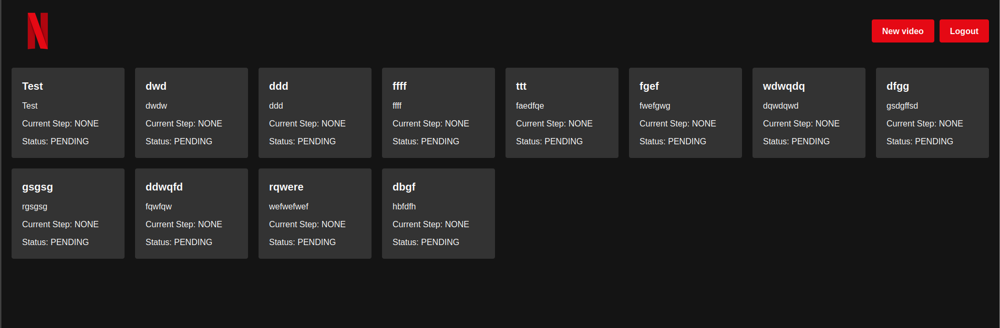

# Netflux ESIR - Frontend

This repository contains the frontend of the Netflux ESIR project used to display videos and metadata.



It relies on the [Netflux backend](https://github.com/NetfluxESIR/backend) to retrieve data and
among other things: it uses Nuxt.js to generate static pages.

## Install

> Note that you need to have the [backend](https://github.com/NetfluxESIR/backend) and 
> the [pipeline](https://github.com/NetfluxESIR/pipeline) running to be able to use the frontend.

### Requirements
- [Node.js](https://nodejs.org/en/download/)
- [pnpm](https://pnpm.io/installation)
- [Docker](https://docs.docker.com/get-docker/) (optional)

### Run from source

```bash
pnpm install
pnpm run dev
```

### Run with Docker

```bash
docker run -p 3000:3000 ghcr.io/netfluxesir/frontend:latest
```

